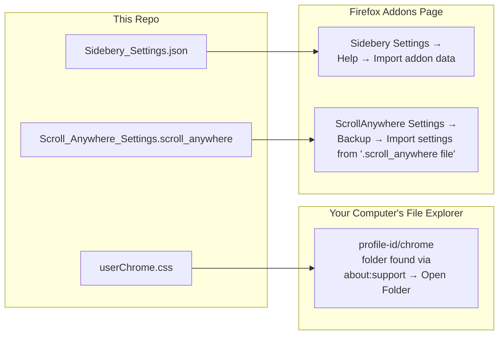

# Yeove's Firefox CSS Tweaks

This is my custom CSS for Firefox.
 It's pretty similar to Firefox's native vertical tabs, but with auto hover / tab search / inline image previews / custom keybinds using the sidebery addon

## Overview

---

## Prerequisites
Install all of this before following the guide

1. [Firefox](https://www.firefox.com/en-CA/download/all/) any modern version
2. [Sidebery](https://addons.mozilla.org/firefox/addon/sidebery/) extension for vertical tabs
3. [Adaptive Tab Bar Colour](https://addons.mozilla.org/firefox/addon/adaptive-tab-bar-colour/) extension for dynamic sidebar colours
3. [ScrollAnywhere](https://addons.mozilla.org/firefox/addon/scroll_anywhere/) extension for grab and drag scrolling using middle mouse button

---

## Setup Guide

### Step 1: Enable userChrome.css support in Firefox

1. Open a new tab and go to `about:config`
2. Search for `toolkit.legacyUserProfileCustomizations.stylesheets`
3. Set it to `true`
 

### Step 2: Install userChrome.css

1. Open `about:support`
2. Find the **Profile Folder** row → click **Open Folder**
      This will open a folder on your desktop:
- `Windows:`  `C:\Users\<YourUsername>\AppData\Roaming\Mozilla\Firefox\Profiles\<profile-id>`
- `Linux:`    `~/.mozilla/firefox/<profile-id>`
- `macOS:`    `~/Library/Application Support/Firefox/Profiles/<profile-id>` 
3. Drag the **chrome** folder from this repo into the **profile-id** folder
    
4. Fully close Firefox by clicking the **☰** menu on the top right, then press **Exit**, or **Ctrl + Shift + Q**
 
5. Relaunch Firefox
  
 

> You should now have custom .css enabled
 
### Step 3: Import Sidebery settings

1. Press `F1` to expand the Sidebery sidebar
2. Click the ⚙️ gear icon on the top right to open Sidebery Settings
3. In the left menu, click **Help**
4. Click **Import addon data**
5. Select `Sidebery_Settings.json` from this repo
6. On the new window that popped up; click **Import addon data**
 

> Importing will overwrite your existing Sidebery settings If you've already set things up the way you like, export your current settings first via Settings → Help → Export addon data

If tab previews aren't working in the sidebar, toggle the `Preview mode: popup in sidebar` setting off and on again, then click `Allow` when Firefox asks to grant Sidebery the required permission.

### Step 4: Import Scroll Anywhere settings

1. Click the Scroll Anywhere icon
2. Click **Options**
3. In the left menu, click **Backup**
4. Click **Import settings from ".scroll_anywhere file"**
5. Select `Scroll_Anywhere_Settings.scroll_anywhere` from this repo
6. On the bottom of the page, click **Save changes and close**

## Optional Tweaks

###  Step 5: Move Sidebery to the right side of the window

1. Right-click the Sidebery icon in your toolbar
2. Select **"Move sidebar to right"**
  or in `about:config`, set `sidebar.position_start` to `false`

## Step 6: Enable Live Editing for CSS

Want to mess with CSS and see changes instantly without restarting Firefox?
 Use the **Browser Toolbox**:

1. Open Firefox and press **F12** on any page to open regular DevTools
2. Click the ⚙️ gear icon, or press F1 to open settings
3. Enable **"Enable browser chrome and add-on debugging toolboxes"**
4. Enable **"Enable remote debugging"**
5. Press **Ctrl + Shift + Alt + I** to open the Browser Toolbox
6. Go to the **Style Editor** tab
7. Find `userChrome.css` in the stylesheet list
8. Now you can edit changes live in the browser, and see them happen in real time

> Edits in the Browser Toolbox are temporary and disappear when you close it Treat it like a scratchpad; find what works, then paste it into your real `userChrome.css` If you totally screw up the browser, just close the Browser Toolbox and reopen it to start fresh

### Additional Notes

**Optional Firefox Extensions I Like**
- [uBlock Origin](https://addons.mozilla.org/en-US/firefox/addon/ublock-origin/) Prevents Ads on Websites
- [YouTube Nonstop](https://addons.mozilla.org/en-US/firefox/addon/youtube-nonstop/) Prevents YouTube from pausing automatically in the background, good for music playlists
- [Auto Tab Discard](https://addons.mozilla.org/en-US/firefox/addon/auto-tab-discard/) Automatically puts unused tabs to sleep, reducing the amount of RAM Firefox uses
- [Keepa - Amazon Price Tracker](https://addons.mozilla.org/en-US/firefox/addon/keepa/) Lets you see a historical price chart of past prices on Amazon Items

**Credits - Stuff I Lovingly Stole From People:**
- Base config by [CLHowell on Pastebin](https://pastebin.com/6z7QU7ps)
- Reddit [r/FirefoxCSS](https://www.reddit.com/r/FirefoxCSS/comments/1rno75d/sidebery_expandonhover/)

---

## License

Do whatever you wanna do. Fork & adapt as much as you want
